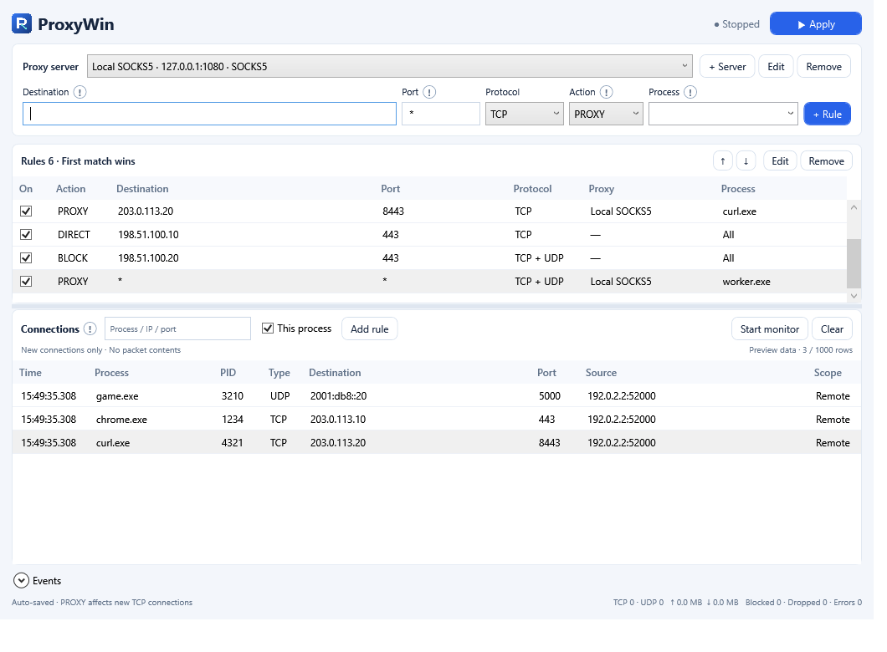

# ProxyWin

**Windows x64 GUI for routing selected IPs or processes through SOCKS5 and HTTP proxies.**

ProxyWin uses WinDivert 2.2.2 to apply ordered **DIRECT**, **PROXY**, and **BLOCK** rules to outbound TCP/UDP traffic. No virtual adapter or system route changes are needed.

**Current release: [0.5.0](https://github.com/pshho/ProxyWin/releases/tag/v0.5.0)** · [Download ZIP](https://github.com/pshho/ProxyWin/releases/download/v0.5.0/ProxyWin-0.5.0-win-x64.zip) · [SHA-256](https://github.com/pshho/ProxyWin/releases/download/v0.5.0/ProxyWin-0.5.0-win-x64.zip.sha256)



*The screenshot uses synthetic connection data.*

## Features

- Multiple SOCKS5 and HTTP proxy servers, including username/password authentication.
- Ordered DIRECT / PROXY / BLOCK rules with destination, port, protocol and process conditions.
- IPv4/IPv6 IPs, CIDR ranges and destination `*` for process-wide rules.
- TCP through SOCKS5 or HTTP CONNECT; UDP through SOCKS5 UDP ASSOCIATE.
- Live new-connection metadata: executable name, PID, protocol and endpoints.
- Create a rule from an observed connection or search running processes by name.
- Compact English UI, round **!** help buttons and an application icon.
- Windows DPAPI-protected settings.

## Download and run

1. Download the ZIP from [Releases](https://github.com/pshho/ProxyWin/releases/latest).
2. Extract the **entire** archive. Keep its runtime files and `driver` directory together.
3. Run `ProxyWin.exe` as administrator to apply rules or monitor connections.

The release is self-contained; a separate .NET installation is not required. Windows 10/11 x64 is the target platform. Local testing was performed on Windows 11 x64.

To compare the download with the published checksum:

```powershell
Get-FileHash .\ProxyWin-0.5.0-win-x64.zip -Algorithm SHA256
```

**Verification status:** 16/16 non-elevated regression groups and published GUI/caret checks passed. The 0.5.0 administrator driver suite **was not run because UAC approval was cancelled**. Actual wildcard interception remains unverified. See [VERIFICATION.md](VERIFICATION.md) before relying on the new routing behavior.

## Quick start

1. Use **+ Server** to add a SOCKS5 or HTTP proxy. DIRECT and BLOCK need no server.
2. Enter **Destination**, **Port**, **Protocol**, **Action** and optionally **Process**, then click **+ Rule**. PROXY uses the selected server.
3. Arrange rules with **↑ / ↓**. The first matching rule wins.
4. Click **Apply**. Open a new connection in the target application for PROXY rules to take effect.
5. Click **Stop** before editing rules. Monitoring can remain active.

Hover over or click a round **!** for field help. Settings save automatically.

| Field | Examples |
| --- | --- |
| Destination | `203.0.113.10`, `10.20.0.0/16`, `2001:db8::/32` |
| Multiple destinations | `203.0.113.10, 198.51.100.20` |
| All IPv4 and IPv6 destinations | `*` |
| All IPv4 / all IPv6 | `0.0.0.0/0` / `::/0` |
| Port | `443`, `443, 8000-9000`, or `*` |
| Process | `chrome.exe`; blank means all processes |

Documentation IPs above are examples. Replace them with your intended destinations. Domains and partial IP patterns such as `192.168.*.*` are not supported; use CIDR for address ranges. Loopback/self traffic remains excluded.

### Process-wide rule

To route Chrome's non-loopback TCP and UDP traffic through a SOCKS5 server:

| Setting | Value |
| --- | --- |
| Destination | `*` |
| Port | `*` |
| Protocol | `TCP + UDP` |
| Process | `chrome.exe` |
| Action | `PROXY` |
| Proxy server | Your SOCKS5 server |

Select **TCP** for an HTTP/Burp proxy. Choose **DIRECT** or **BLOCK** for the corresponding process-wide action.

Process search accepts part of a name, but the rule matches the **full executable name**, case-insensitively. All instances with that name match; this is not a PID, executable-path or signature filter. You can type a currently inactive executable's name manually. All destination, port, protocol and process conditions must match.

### Rule actions

| Action | Behavior |
| --- | --- |
| DIRECT | Pass traffic through its existing network path |
| PROXY | Relay through the configured SOCKS5 / HTTP server |
| BLOCK | Silently drop matching outbound packets |

Put narrow DIRECT exceptions above broader PROXY/BLOCK rules. Unmatched traffic defaults to DIRECT; a DIRECT-only configuration does not capture packets.

BLOCK may appear as a timeout to the client. It does not undo data already received. Stopping/exiting releases the filter; this is not a persistent kill switch or an inbound firewall. Own relay sockets and active local proxy processes are exempt to prevent loops.

## Monitor connections and create rules

1. Click **Start monitor** in **Connections**.
2. Make a new connection in the target application.
3. Filter by process, PID, IP or port and select a row.
4. Choose an action and, for PROXY, a server above.
5. Click **Add rule**. **This process** restricts the rule to the observed executable name.

The generated rule uses that connection's exact destination, port and protocol. To cover the process's other destinations, edit the rule and set Destination to `*`. Identical rules are selected instead of duplicated; disabled identical rules are re-enabled.

Monitoring uses read-only WinDivert FLOW metadata. It records no packet contents, HTTP bodies or credentials. Only new flows appear; pre-existing connections and failed TCP attempts may be absent. The newest 1,000 rows remain in memory, with a bounded 2,048-entry queue. Overload can omit records. **Stop monitor** only stops observation.

## TCP, UDP and Burp

- **SOCKS5:** TCP CONNECT and UDP ASSOCIATE, with optional username/password authentication.
- **HTTP/Burp:** TCP HTTP CONNECT. UDP requires a separate SOCKS5 rule.
- The original destination's numeric IP and port are passed to the upstream proxy. ProxyWin does not change application HTTP Host or TLS SNI.
- The upstream proxy can apply its own DNS, redirect or routing policy. Burp integration and TLS interception require separate validation and appropriate certificate trust in the target application.
- The external server sees the proxy's outbound network identity; the original public source IP and source port are not preserved.
- There is no certificate-pinning bypass feature.

## Scope and limits

- Specific-IP rules narrow kernel capture. Destination `*` broadens capture before Windows socket-owner lookup, so process-wide rules can increase CPU usage.
- Captured TCP/UDP IP fragments are dropped because reassembly is unsupported; fragments cannot always be classified by process or port. SOCKS5 UDP fragmentation is also unsupported.
- Shared UDP ports and short-lived sockets can make process attribution ambiguous. When required attribution fails, captured packets are dropped instead of silently bypassing the proxy.
- Failed proxy connection/authentication does not fall back to DIRECT.
- Loopback/self destinations are excluded. General unicast TCP/UDP is the supported scope.
- Resource bounds include 2,048 concurrent TCP relays, 16,384 TCP mappings and 512 UDP associations. UDP queues are bounded to 32 packets per association and 16 MiB of queued payload globally.
- **Blocked** counts intentional BLOCK decisions; **Dropped** and **Errors** report application-observed failures. These counters do not measure every possible driver/network loss.
- Long-duration load, VPN coexistence, network changes, sleep/resume and live external IPv6 interception remain unverified. No throughput floor or uninterrupted-operation guarantee is made.

## Settings

Settings are encrypted for the current Windows user at `%LOCALAPPDATA%/ProxyWin/profile.dat` using DPAPI and atomic writes. Existing server names, credentials and rules are preserved. Observation rows are not persisted.

Profile format version 2 stores explicit actions. Legacy version-1 DIRECT/proxy configurations remain readable. ProxyWin 0.5.0 accepts destination wildcard rules; 0.4 rejects active all-destination rules. A corrupt profile locks editing instead of being overwritten.

The official driver is SHA-256 pinned, and setup checks its Authenticode signature. Security software can prevent driver loading. Closing ProxyWin releases its capture handles but does not uninstall a shared WinDivert service used by another application.

## Build and test

Use the **.NET 10 SDK on Windows x64** and PowerShell. There are no external NuGet package dependencies.

```powershell
git clone https://github.com/pshho/ProxyWin.git
cd ProxyWin
./scripts/Build.ps1
```

The script downloads and verifies the official WinDivert files, runs non-elevated tests, and publishes to `artifacts/ProxyWin-0.5.0-win-x64`.

```powershell
# Optional framework-dependent publication
./scripts/Build.ps1 -FrameworkDependent

# Local regression suite
dotnet run --project tests/ProxyWin.Tests/ProxyWin.Tests.csproj -c Release

# GUI fixtures: no driver opened and no user profile changed
dotnet src/ProxyWin.App/bin/Release/net10.0-windows/win-x64/ProxyWin.dll --smoke-test "$PWD/artifacts/ui-smoke-v05"
dotnet src/ProxyWin.App/bin/Release/net10.0-windows/win-x64/ProxyWin.dll --picker-test "$PWD/artifacts/picker-after-v05.txt"

# Actual driver tests: prompts for Windows UAC
./scripts/Test-Driver.ps1
```

Driver tests generate traffic only to documentation addresses `203.0.113.10` / `203.0.113.11` at declared ports and local fake proxies. Lower-priority test filters consume DIRECT test traffic. Wildcard tests select TCP/UDP 7446 and the unique test executable; fragments are additionally captured. Observation fixtures are restricted to test PIDs. Tests do not change system routes.

Do not change the global PowerShell execution policy just to run the scripts. Where necessary, use a reviewed, process-local policy exception.

## Source layout

| Path | Purpose |
| --- | --- |
| `src/ProxyWin.App` | WPF GUI, process picker and application messages |
| `src/ProxyWin.Core` | Rules, filter plans and packet transformations |
| `src/ProxyWin.Windows` | WinDivert, relays, process attribution and encrypted settings |
| `tests/ProxyWin.Tests` | Console regression suite and scoped driver fixtures |
| `tools/ProxyWin.IconBuilder` | Generate ICO/PNG from the included original vector drawing |
| `scripts` | Driver setup, build and elevated tests |

## Third-party components

See [THIRD-PARTY-NOTICES.md](THIRD-PARTY-NOTICES.md) and [driver/LICENSE](driver/LICENSE). WinDivert is distributed unmodified. Self-contained releases include .NET/WPF runtime license and notice files.

Official references: [WinDivert documentation](https://reqrypt.org/windivert-doc.html), [WinDivert 2.2.2 source](https://github.com/basil00/WinDivert/tree/v2.2.2), [Burp Proxy settings](https://portswigger.net/burp/documentation/desktop/settings/tools/proxy).
